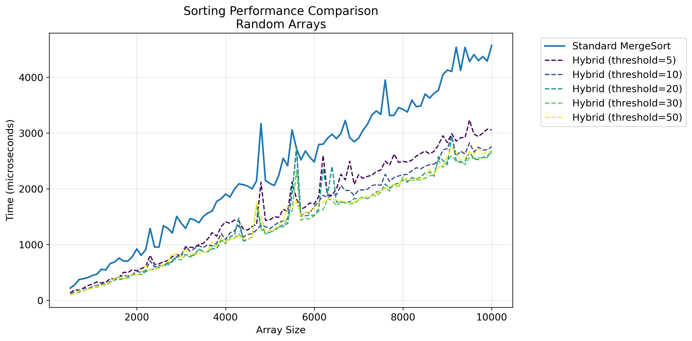
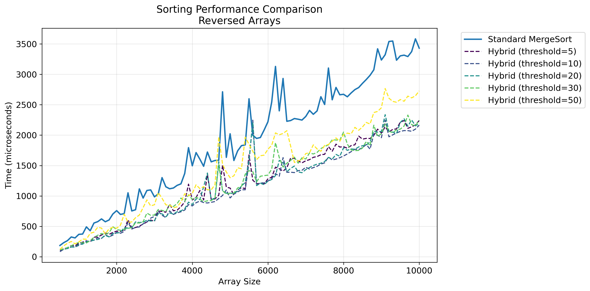
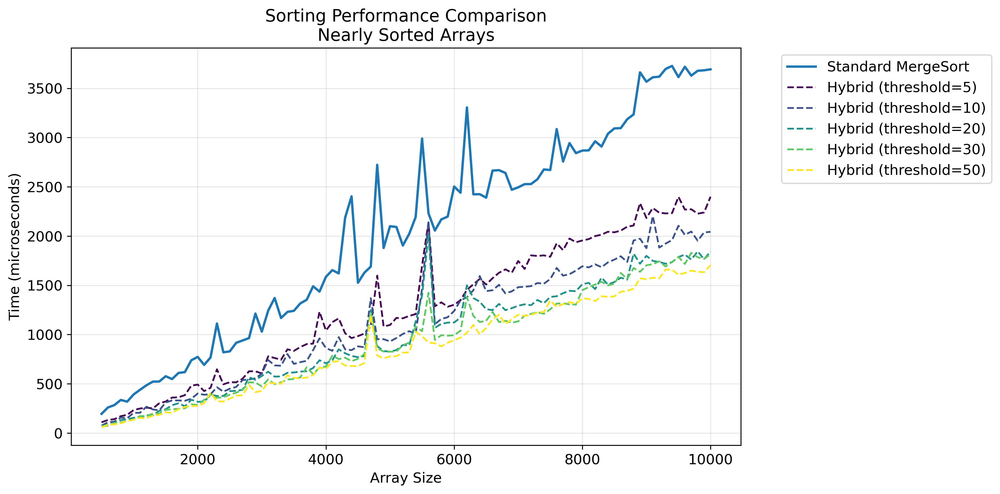

# A2

## Ссылка на решение <https://dsahse.contest.codeforces.com/group/NOflOR1Qt0/contest/565612/submission/293161621>

## ID посылки 293161621

## Результаты тестирования

### Случайные массивы

### Отсортированные в обратном порядке массивы

### Почти отсортированные массивы

## Анализ результатов

Анализ графиков для различных типов массивов (случайных, обратно отсортированных и почти отсортированных) демонстрирует следующие закономерности:

1. Модифицированный алгоритм сортировки показывает значительное преимущество в производительности:

    - На массивах размером до 10000 элементов наблюдается ускорение в полтора и более раз
    - Величина улучшения производительности зависит от выбранного значения threshold

2. При увеличении порогового значения (threshold) характер производительности будет меняться, однако даже при относительно высоком пороге в 100 элементов наблюдается существенное улучшение скорости по сравнению с классическим алгоритмом.

### Ключевые выводы

1. Модифицированный алгоритм с механизмом переключения демонстрирует явное преимущество над классической реализацией.
2. Выбор значения threshold существенно влияет на производительность, при этом оптимальными оказались средние значения (20 и 30 в данной реализации).
